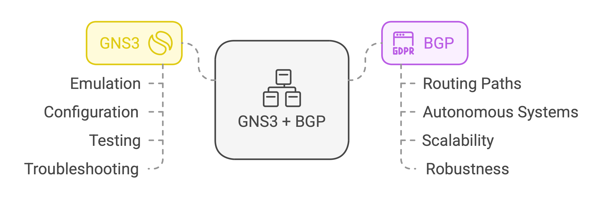
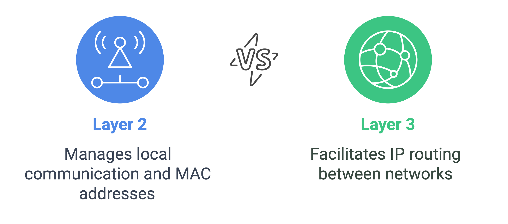
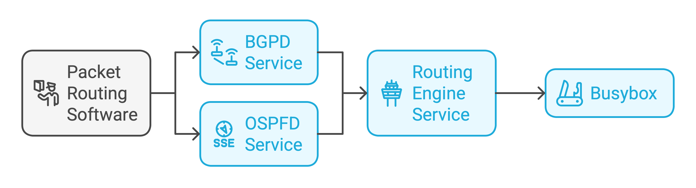
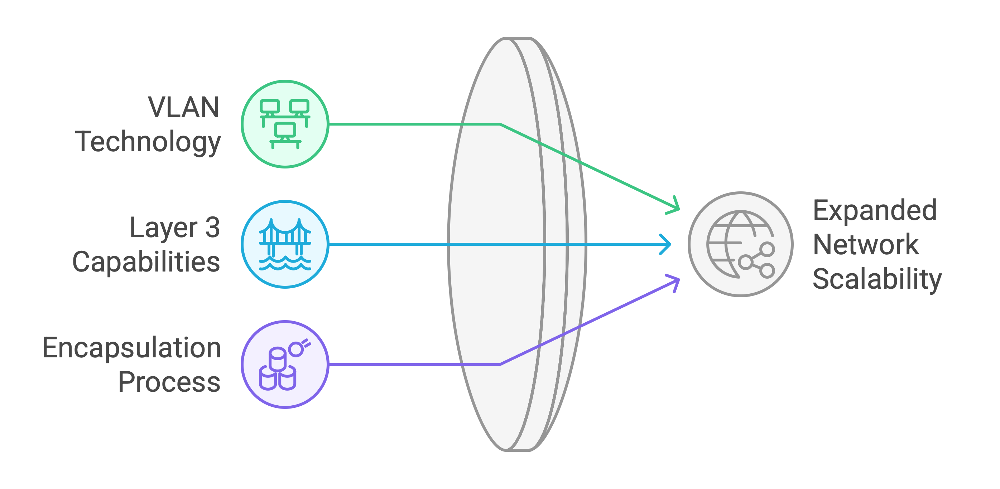
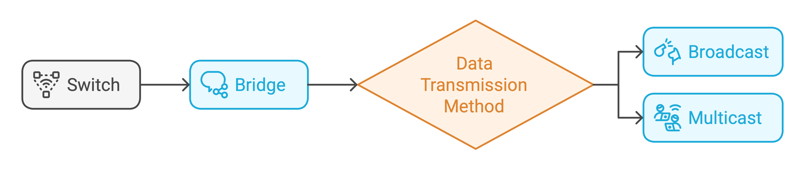
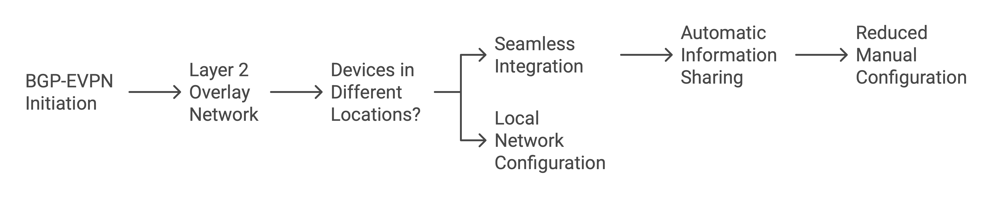
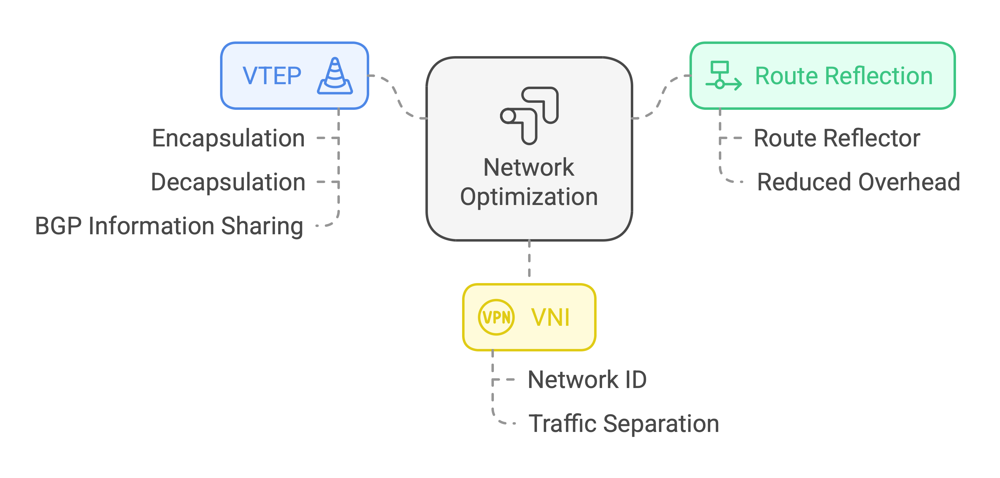
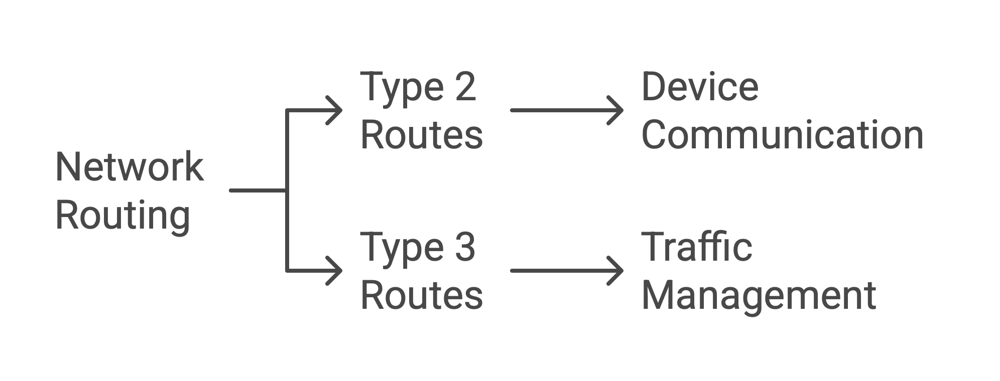

# BGP at the Doors of Autonomous Systems is Simple

## GNS3 Basics
**GNS3** is a network simulation tool that allows users to emulate, configure, test, and troubleshoot virtual and real networks. It integrates with Docker for containerized applications, supports routing protocols like BGP, and enables testing in isolated environments.
- Works as a sandbox where you can connect virtual computers and routers using "virtual wires" and see how data flows.

**BGP** *(Border Gateway Protocol)* is the protocol behind Internet routing. It manages the paths that data packets take by exchanging routing information between autonomous systems. The main interest lies in its scalability, robustness, and ability to support policies.
- Decides the best path for data to travel between networks worldwide.
- **EX:** If you're streaming Netflix, BGP ensures the fastest and most efficient path for the video to reach your device, even if it has to cross multiple networks.

## OSI layers
**Layer 2** *(Data Link Layer)* is responsible for local node communication and MAC address handling within the same network. **Layer 3** *(Network Layer)* handles IP routing and communication between different networks using routers.
- **EX:** If your laptop sends a file to another laptop in the same Wi-Fi network, Layer 2 handles it. If you're sending an email to someone on a different continent, Layer 3 takes over.

## GNS3 Configuration
**Packet routing software** *(Quagga, Zebra, etc.)* is used for routing packets based on protocols like OSPF, BGP, or RIP.
- Tells data packets how to travel between networks.
- **EX:** Imagine you're sending a letter. Packet routing software is like a postal worker figuring out the shortest and most efficient route to deliver your letter.

**BGPD service** *(BGP Daemon)* allows devices to exchange routing information over BGP.
- Lets devices exchange routes with each other, making sure they know the best paths to reach different networks.
- **EX:** Two routers using BGPD can share their "maps" of the Internet to find the best route for your emails or YouTube videos.

**OSPFD service** *(OSPF Daemon)* implements OSPF to dynamically share and calculate routes between devices.
- Finds the shortest and fastest route within a single network.
- **EX:** OSPFD is like a GPS that recalculates the quickest way through a city based on traffic.

**Routing engine service** refers to engines like Quagga or FRRouting that manage routing protocols (e.g., BGP, OSPF) and their interactions.
- Helps devices decide where to send data.
- **EX:** It’s like a control tower at an airport managing the paths for all flights.

**Busybox** is a lightweight software providing essential Unix tools in a single binary.
- **EX:** If a full Linux system is like a big Swiss Army knife, Busybox is a compact version with just the essential tools.

## VXLAN
**VXLAN** *(Virtual Extensible LAN)* extends VLAN capabilities over Layer 3, enabling larger scalability by using a 24-bit ID.
- VLAN connects devices as if they’re in the same local network, even if they’re not.
- VXLAN expands VLANs over the Internet by using encapsulation. It supports up to 16 million networks compared to VLAN’s 4,096.
- **EX:** VLAN is like a private chat group, while VXLAN is a private chat group that works across countries.

## Network devices
**Switch** is a network device connecting multiple devices within the same VLAN.
- Forwards the data to the correct device based on MAC addresses.

**Bridge** is a device or software to connect two network segments, often used in VXLAN setups.
- Acts as a middleman to pass data between two separate networks.

**Broadcast** sends data to all devices on a network. **Multicast** sends data only to subscribed devices.
- **EX:** Broadcast is like shouting in a room, and multicast is like calling only your friends.

## BADASS - PART 2
| **Node**            | **Type**         | **Setup**                           | **Communication Method**    |
|---------------------|----------------|-------------------------------------|-----------------------------|
| _ffarkas-1_s     | static VXLAN    | fixed remote IP 10.1.1.2        | manual point-to-point       |
| _ffarkas-2_s     | static VXLAN    | fixed remote IP 10.1.1.1        | manual point-to-point       |
| _ffarkas-1_g     | dynamic VXLAN   | multicast group 239.1.1.1        | auto-discovery              |
| _ffarkas-2_g     | dynamic VXLAN   | multicast group 239.1.1.1        | auto-discovery              |
| _ffarkas-1_host  | host            | IP 30.1.1.1                     | connected via bridge (br0) |
| _ffarkas-2_host  | host            | IP 30.1.1.2                     | connected via bridge (br0) |

## BGP-EVPN
**BGP-EVPN** *(Ethernet VPN)* enables Layer 2 overlay networks using BGP extensions. This type of network enables data centers to connect seamlessly.
- Even if two devices are in different physical locations, BGP-EVPN makes them feel like they are on the same local network.
- It reduces the need for manual configuration by automatically sharing important information like MAC and IP addresses.

## Network optimization
**Route reflection** reduces the need for full-mesh BGP by allowing certain routers to propagate routes.
- Instead of each router talking to every other router, one router (the Route Reflector) forwards updates, reducing overhead.

**VTEP** *(Virtual Tunnel End Point)* encapsulates and de-encapsulates VXLAN traffic.
- A VTEP is like a VXLAN gateway, encapsulating and decapsulating VXLAN packets, allowing them to travel over the Layer 3 network.
- BGP is used to share information between VTEPs about which devices (MAC addresses) are on the network and how to reach those devices (IP addresses or paths).

**VNI** *(VXLAN Network Identifier)* identifies each VXLAN segment.
- VNI (VXLAN Network Identifier) is like a network’s ID tag, helping keep traffic separate.

## Network routes
**Type 2 routes** handle MAC-to-IP mappings for devices.
- They help devices communicate with each other by associating their hardware (MAC) address with their software (IP) address.
- EX: If a device with MAC address AA:BB:CC:DD:EE:FF has IP address 192.168.1.10, the Type 2 route tells the network: “To reach 192.168.1.10, go to the MAC address AA:BB:CC:DD:EE:FF.”

**Type 3 routes** are used for multicast or broadcast traffic.
- They help manage traffic that is sent to multiple devices in the network (e.g., updates, group messages).
- EX: If one device sends a "hello" message to all devices in the network, the Type 3 route ensures it gets delivered efficiently without clogging the network.

## BADASS - PART 3
| **Node**        | **Role**                   | **BGP Configuration**                                  | **OSPF Configuration**          | **VXLAN Configuration** |
|----------------|--------------------------|------------------------------------------------------|--------------------------------|-------------------------|
| _ffarkas-1 | Route Reflector (RR)      | acts as BGP controller, redistributes EVPN routes | OSPF enabled for all networks | no VXLAN setup          |
| _ffarkas-2 | Leaf Router (VTEP)        | connects to RR, advertises VXLAN    | OSPF for internal links       | VXLAN ID 10 configured  |
| _ffarkas-3 | Leaf Router (VTEP)        | connects to RR, advertises VXLAN    | OSPF for internal links       | VXLAN ID 10 configured  |
| _ffarkas-4 | Leaf Router (VTEP)        | connects to RR, advertises VXLAN    | OSPF for internal links       | VXLAN ID 10 configured  |

- <u>BGP</u>: exchanges network reachability information between routers
- <u>EVPN</u>: manages Layer 2 connectivity over Layer 3 networks
- <u>OSPF</u> (as IGP): distributes internal routing information
- <u>VXLAN</u>: extends Layer 2 networks across different locations
- <u>RR</u>: allows a central router to distribute routing information to other routers
